# Graph Engine View and Scene Contract

Date: 2026-10-02

Status: Implemented on 2026-10-02, including accepted edge behavior and
whole-constellation entry from Overview. Regression coverage lives in
`tests/runtime/views.test.ts`, `interaction.test.ts`, and `ego.test.ts`. Obsidian
desktop/mobile smoke verification remains a separate acceptance check.

Related contracts:

- [Ego will and shared prospective plans](graph-engine-ego-interaction-plan-contract.md)
- [Interaction mechanics and current implementation](graph-engine-interaction-state-contract.md)
- [Consciousness and agency ownership](graph-engine-agency-awareness-ontology.md)
- [Graph+ application and host ownership](graph-plus-application-architecture.md)

## 1. Purpose: discover > build > focus; all > many > one

A View defines how Ego engages with the world and how that engagement is presented.
A scene contract makes the View's permitted interest and presentation explicit.
Changing a View does not itself change canonical nodes, relationships, structural
projection, layout or conscious history. Graph+ enables the optional
`attention.clearOnOverviewEntry` policy: returning to Overview clears membership,
while entering Focus or returning from Focus to Constellation retains it.

| View | Purpose | Scope of interest | Tracked interest |
| --- | --- | --- | --- |
| Overview | Discover something interesting | All available objects | None |
| Constellation | Build and view something interesting together | A composed set, including an empty workspace | Centroid by default; retained Vision focal point after Focus exit |
| Focus | Explore the constellation one object at a time | One presentation subject | That object |

"Many" means set-oriented, not a minimum of two objects. Empty Constellation is a
valid build workspace with no centroid until a member is added. A one-object
constellation is valid and remains distinct from Focus. A single click first establishes the
constellation (a whole group when the clicked subject represents one); a further
single click presents an object in Focus.

Constellation and Focus are adjacent framings of the same composition. Entering
Focus must not replace the composition with a singleton, and returning to
Constellation must not reconstruct it from the last focused object.

Product language is Overview, Constellation, and Focus. The current persisted and
public identifier `explore` remains a compatibility spelling for Constellation.

```mermaid
stateDiagram-v2
    Overview --> Constellation: Choose whole constellation
    Constellation --> Focus: Click object
    Focus --> Focus: Click another object
    Focus --> Constellation: Click background
    Constellation --> Overview: Click background
    Overview --> Constellation: Click background; retain membership
```



## 2. Membership, interest, and appearance are different facts

Let `P` be the structurally available projected objects, `C` the resolved
constellation within `P`, `f` the Focus subject, and `N(f)` the visible immediate
graph neighbors of `f`. Neighborhood means one graph edge, independent of direction;
tags follow the same rule. Filtered-out edges cannot establish a visible neighbor.

Consciousness supplies the active composition's membership. `C` is the deliberately
chosen constellation for this presentation session. Attention, Awareness, and Memory
can describe broader conscious state, but remembered or aware subjects outside the
chosen composition do not automatically become members of `C`.

This narrows the earlier draft's use of all Awareness as the scene constellation.
When Overview chooses group `G`, the active composition is exactly its available
membership, not `G` union the previous composition or unrelated Memory. A subject can
remain visible in a Memory constellation without being highlighted as an active member in Constellation or Focus.
Policy-expanded peripheral neighbors also remain outside `C` unless explicitly admitted.

Views do not store a second mutable copy of the composition. Consciousness owns the
active set; the View resolves presentation and interest from it. Attention is the active membership set, and `selectedNodeIds` mirrors it for public
consumers and checkpoints. Broad Awareness is never an active-membership fallback.

The scene's interest is geometry-free: none, a set of subject IDs, or one subject ID.
Vision derives the arithmetic centroid from current available positions. The centroid
is not persisted, weighted by highlight intensity, or supplied by hovering.
Constellation has no private clicked-object camera locus. Its suggested interest is
the set's centroid; Ego's retained focal intent can preserve Vision framing after
Focus exit. The Focus scene still has one presented subject.

The Focus subject belongs to `C`. In Constellation, clicking a dim candidate
outside `C` admits that candidate and its shortest visible path to `C`, and stays in Constellation. A subsequent ordinary
click on a committed member enters Focus. Within Focus, clicking a dimmed neighbor admits
that candidate and its shortest connecting path and hops the subject in one operation, preserving existing members. Unrelated neighbors are never implicitly admitted.
This permits exploration through visible dimmed neighbors while keeping "one from many" true.

### Memory and Ego constellation sources

Updated 2026-10-03. `Constellation.kind` is `ego` or `memory`; source identity
belongs to Consciousness and is independent of Anima's color or highlight phase.
Graph+ currently disables visible Memory constellations. Its RC working-constellation
experiment instead adds active notes to Attention without changing Global View or
camera, retains previous Focus roots, and clears the group on return to Overview.
The following Memory source rules remain available to other consumers. Actual graph
links group remembered subjects into Memory constellations;
disconnected remembered notes remain valid singleton constellations. No synthetic
links or canonical nodes are created.

Memory-only nodes and internal links use the semantic `memoryConstellation` theme
color (cool blue by default). The newest prior note uses 100% color strength, the
second 50%, and the third 25%; an internal link uses its older endpoint's strength.
Active membership, including admitted Will previews,
takes visual priority on overlap. Mixed-source links retain ordinary link color.
Remembered nodes do not receive selection outlines solely because they are remembered.
They remain hittable and readable in all Views, but obey structural filtering.
They never become active membership, expand ordinary Focus neighbors, or acquire
camera-follow ownership merely by being visible. Explicit Focus scene Fit includes the
visible Memory field; ordinary Focus entry still preserves scale and orientation.

Overview resolves a hit through one source: a deliberate member selects its Ego
component; a Memory-only member selects its remembered component. An unlit entry
point can join directly adjacent components of one source, preferring Ego when both
sources are adjacent. Source groups do not silently merge. A shared remembered and
attended subject remains part of Memory's underlying component, but its own hit uses
Ego. Lookup caches and Will freshness include the separate source memberships.
Choosing a Memory group commits its captured members into Attention through the
ordinary Ego/Experience plan. Hover previews that deliberate result without changing
Memory; pointer leave restores the Memory color. Removing deliberate membership
reveals the remembered source again while it remains in the recent trail.

## 3. Exact presentation rules

| Object class | Overview | Constellation | Focus |
| --- | --- | --- | --- |
| Constellation member | Highlighted emphasis is permitted | Highlighted | Highlighted, even when distant from `f` |
| Focus subject | No special tracked role | No singular tracked role | Highlighted with a distinct focus affordance |
| Remembered subject outside active membership | Memory color | Memory color | Memory color, including distant subjects |
| Ordinary immediate neighbor of `f` outside `C` | Standard | Dimmed | Dimmed |
| Every other ordinary projected object outside `C` | Standard | Dimmed | Void |

Overview has no View-induced dimming or voiding. Structural filters can still exclude
objects before the scene is resolved. Constellation keeps all projected context visible and dims ordinary non-members.
Memory constellations remain independently highlighted in their own color in every
View. Focus preserves active and Memory constellations and exposes local ordinary
context around the object being presented. Memory does not expand that neighborhood.

The default Focus scope interprets "neighbors" as **neighbors of the focused object**,
not the union of every constellation member's neighbors. This scope is accepted.
Constellation membership wins over the non-neighbor void rule:
distant members remain highlighted. Otherwise Focus would erase the composition it
is meant to explore.

```text
Overview:     member -> permitted highlight; remembered -> Memory highlight; otherwise standard
Constellation: member -> highlighted; remembered -> Memory highlight; otherwise dimmed
Focus:        member -> highlighted
              else remembered -> Memory highlight
              else immediate neighbor of focused subject -> dimmed
              else -> void
```

Before the hover-awareness lift, links inherit the weaker presentation phase of their endpoints. A link touching a
void object is void; a highlighted-to-dimmed link is dimmed; a member-to-member link
is highlighted. Memory-to-Memory links use the Memory color; a mixed-source link
does not imply one shared constellation. A renderer cannot expose a hidden endpoint by drawing its link.

### Hover previews object activation

Hover evaluates the same ordinary object-activation plan and Experience admission
policy as a click, without executing it. **View and preview are separate concepts.**
Committed View is independent of preview. Will retains the complete click outcome.
Anima receives a discriminated preview: `objects` retains committed context for
admission/removal; `view-transition` borrows the admitted resulting scene for
explicit View entry or Focus hops. Neither lane commits View or membership.

- **Overview:** an actual node hover previews its admitted Constellation destination
  with that same node hovered there. The gravity field alone cannot start a preview.
- **Constellation:** a candidate previews admission with ordinary hover; a member
  previews Focus with the same node hovered in Focus.
- **Focus:** a different subject previews the admitted Focus neighborhood with that
  new subject hovered. The focused subject retains ordinary Focus hover.

Resolve the admitted destination once, then apply its hover policy once. A hover in
Constellation admission raises the hovered node, immediate projected neighbors and
incident links by one degree. View transitions use the destination's hover policy,
not the source View's. A Focus root has no next transition, so hovering it leaves
its dim neighbors and context links unchanged. A neighbor preview presents the new
root with the normal dim neighborhood and a full root-size hover label. Destination
hover does not recursively plan another View transition. With Anima enabled, primary
previews wait 0.2 seconds and fade in over 0.5 seconds; cancellation fades back over
0.5 seconds. Cursor distance does not blend scenes.

| Before hover lift | During hover lift |
| --- | --- |
| Void | Dimmed |
| Dimmed | Standard |
| Standard | Highlighted |
| Highlighted | Highlighted |

Resolve the admitted scene first, then lift affected objects once. A node raised
by hover does not lift its other links or neighbors recursively. Links start from
the weaker endpoint phase before this lift; in Constellation and Focus only links
incident to the hovered node receive the extra degree. Overview does not lift links. Selected members, Memory and admitted path highlights
remain capped at highlighted. This is transient presentation, not a change to
Consciousness Awareness, membership, Memory, or constellation provenance. Repeated
hover does not accumulate degrees; leaving restores the scene. Revealed dim nodes
can be picked, while unrelated void nodes remain unavailable.

The lift composes with an object-delta action preview. Ctrl removal and
no-change previews bypass it so deselection cannot immediately re-light the node.
Filtered edges cannot reveal neighbors. Neighbors raised to standard or highlighted
receive adaptive label saliency rather than forced visibility; dim/void neighbors
retain their label suppression. Explicit action-preview admission/path highlights
are independent of this one-degree rule.

A hover visit captures the admitted node and View outcome. Clicking commits that
outcome and latches the admitted presentation, so the exact scene already under the
pointer remains visible rather than advancing to a different next action. Movement
inside the same node, modifier changes and external state updates cannot rearm it. The
pointer must leave the node before another preview can be computed. The latch includes
ordinary awareness lifting, label policy, revealed hit targets, and prospective
node/View deltas and the admitted destination's hover expression. A node click
commits the destination View and retains that same hovered scene until the pointer
leaves, instead of immediately previewing a further View. Another click before leaving still resolves fresh committed state and
performs its transition normally.

Hover also highlights the shortest graph path back to the nearest member of the active
deliberate constellation.
"Nearest" means fewest undirected edge hops through projected nodes and visible edges, independent
of spatial layout. In Constellation and Focus, destinations are committed Attention members of active
`C`; passive Memory is never a route target. Overview does not present a hover route. A user can first choose a Memory constellation
to adopt it into Attention and then grow from it. Stable
node-ID traversal resolves equal-length ties. A member needs no path; with no reachable
constellation, only the ordinary object preview applies. Intermediate path nodes and
links become highlighted and readable, even if the committed Focus scene would
otherwise void them. Hover alone is transient. Adding the candidate commits the route
as membership; its nodes remain highlighted after pointer leave. A disconnected candidate
is added alone, and filtered nodes/edges cannot bridge a route. Overview whole-group
entry replaces membership using its existing group lookup, without merging a route to
the previous constellation. A route
revealed during Focus is interactive, just like other visible context.

**Ctrl-hover previews Ctrl-click removal**, using the same idempotent removal plan and
Experience admission. A member previews removal; a nonmember has an explicit no-change
outcome. Subject removal dims that object while retaining committed Focus context;
last-member removal cannot expose Overview before click. Those actual View exits
remain in Will and commit on activation. Ctrl removes only the clicked member and never adds a path. After
removal commits, holding Ctrl keeps the deselected scene instead of previewing re-addition.
Ctrl on a nonmember adds no outline, path, phase change, or hover-forced label. Independent
Memory presentation is preserved. Prospective membership determines outlines and phases.
Releasing Ctrl updates the ordinary action preview only before activation; after a click,
the admitted removal preview remains latched until leave. Leaving restores the committed
scene. A removal preview that voids its own hovered target retains
only that already acquired target for hit testing, so it can be clicked without flicker.
It does not expose any other void subject.

Leaving the node restores the committed scene immediately. A visible standard Focus neighbor
can become the next hover or click target. Void objects cannot initiate hover through
an invisible object, lingering edge, or label. Preview is derived from committed
membership and the current candidate; preview highlights never feed constellation
lookup or accumulate prospective members. Rejected activation has no object preview;
adjusted activation previews its admitted object deltas, including cardinality limits.

Hover changes visual phases, outlines, and labels only. It never changes the current
View, Focus subject, Attention, Memory, camera interest or pose, layout, settings,
history, or host actions. Click is the commit boundary. Hover lighting never counts
as committed membership: clicking a provisionally lit candidate admits it and its
connecting path while remaining in Constellation. A prospective Focus subject has the Focus outline and label emphasis; dimmed neighbors and void context suppress labels. Ordinary
hover scene preview is distinct from the modifier-held note-content preview.

### Label reveal policy

Each View declares label reveal eligibility in `GRAPH_VIEW_DEFINITIONS_V1.scene.labels`.
Anima evaluates this policy against committed context for object deltas, or admitted prospective context for deliberate View transitions.
Focused, prospective-focus, and hovered non-void subjects force their labels;
highlighted subjects, including the transient nearest-constellation path, force theirs.
Focus is the exception for passive session Memory: its labels remain adaptively eligible
rather than forced. The Focus root retains its resolved label size while labels for its
immediate graph neighbors render at 50%.
Dimmed and void context suppress labels, except that the hovered non-void subject is
readable. Ctrl-removal previews override hovered-label forcing and suppress the
removed member's label without previewing the eventual View exit. Standard
Overview subjects fall back to the normal label settings.

The label manager and renderer still own adaptive saliency, collision/layout budgets,
font, position, and the fallback label mode. They do not choose View reveal eligibility.
This codifies existing label behavior; it does not introduce additional neighbor labels.

## 4. Navigation and composition

Primary stationary activation of an existing member descends one View; a dim
Constellation candidate is admitted without descent. Primary stationary background
activation toggles Overview and Constellation, retaining user membership and framing.
With no selected members, Overview background opens an empty build workspace without
selecting remembered subjects. Focus background releases its subject into Constellation.
Focus object activation changes its subject. Escape remains Back and stops at Overview.

| Current View | Primary activation | Result | Membership effect |
| --- | --- | --- | --- |
| Overview | Unhighlighted candidate `x` | Constellation | Admit `x` and its shortest visible route |
| Overview | Choose constellation `G` through a committed highlighted hit | Constellation | Replace active `C` with the whole available membership of `G` |
| Overview | Background | Constellation | Preserve user membership, including an empty set |
| Constellation | Member `x` | Focus on `x` | None |
| Constellation | Dim candidate `x` | Constellation | Admit `x` and its shortest visible route, retaining `C`; preserve camera |
| Constellation | Background | Overview | Preserve `C` |
| Focus on `f` | Another member `x` | Focus on `x` | None |
| Focus on `f` | Standard neighbor `x` | Focus on `x` | Admit `x` and its shortest visible route, retaining `C` |
| Focus on `f` | Same object `f` | Focus on `f` | None; no repeated fit or zoom ratchet |
| Focus on `f` | Background | Constellation | Preserve `C`; release the singular subject |

### Overview selects a whole composition

The Overview hit identifies a selection unit `G` with explicit canonical member IDs.
Selecting it commits `C = members(G) intersect P` and enters Constellation atomically.
The clicked object is the entry point, not a private camera locus or the sole member.
The resulting camera interest is `centroid(C)`. No singular Focus subject is installed.
The accepted camera rule still preserves framing on this first descent.

- A group `{a, b, c}` produces `C = {a, b, c}`; all three become highlighted and all
  other projected objects become dimmed in Constellation.
- If a previous composition `{d, e}` was retained in Overview, selecting `{a, b, c}`
  makes the new active set `{a, b, c}`, not `{a, b, c, d, e}`. Previous subjects may
  remain in Memory, but they do not enlarge the newly chosen composition.
- Clicking `b` next presents `b` in Focus while retaining `{a, b, c}`. This click
  cannot rerun Overview group selection and replace the composition again.
- A selection unit explicitly containing only `a` remains a valid singleton
  constellation. Merely clicking one member of a known group cannot shrink that group.
- Resolve membership against the document revision of the hit. Reject stale or
  unavailable group selection instead of committing an accidental partial singleton.
- Capture the membership chosen by this activation. Later spatial movement, hover,
  or visual regrouping cannot silently replace it. Canonical removal and explicit
  composition/exogenous edits reconcile the active set through their own effects.

The membership resolver follows the agreed highlighted-connectivity rule. Start at
the clicked canonical node, inspect its projected neighbors, and recursively traverse
only neighbors already members of the resolved source: Attention for Ego, remembered subjects for
Memory. Stop at every object outside that source. The clicked seed is explicitly included even when it
starts unhighlighted; it can admit and join directly adjacent lit groups. This does
not traverse an unlit bridge elsewhere in the graph.

Consciousness stores each result as an immutable `Constellation` object with an ID and
canonical member IDs. Hits within an entirely highlighted connected group look up the
same object. The cache invalidates on document revision, projected nodes/edges, or
separate Attention/Memory membership changes. Selection captures the members into Attention, so
subsequent regrouping cannot change the active composition silently. Screen proximity
and node-regions are not membership inputs.

`Consciousness.resolveOverviewConstellation` resolves the current projected graph for
`GraphSessionRuntime`. The group cache lasts for the session; active membership persists
through the existing `selectedNodeIds` checkpoint mirror. Historical Memory observations
remain separate from this derived group lookup.

"Back out a View" is one level per activation, not a jump from Focus to Overview.
Returning to Overview releases tracking; it does not mean clearing the composition
or Memory. The View hierarchy is fixed and bounded, not an unbounded navigation stack.

Composition needs an explicit action because ordinary object clicks descend.
Ctrl-click on desktop removes deliberate membership without descending and does
nothing to an already-unselected node. Add/Remove constellation menu actions remain
explicit toggles on desktop and touch. Those menu actions use Ego's explicit toggle
input, including path admission for addition;
programmatic `setSelection` remains an exact-set operation for host-owned truth.
A shared control can provide Clear constellation. Clear is an explicit Consciousness
operation with an outcome distinguishing Attention withdrawal from forgetting retained
Memory. Removing a remembered subject from active `C` withdraws deliberate membership;
its independent Memory appearance remains until it leaves the recent trail.

Membership edits never create canonical links. Adding a candidate also admits its
shortest visible path to existing membership; disconnected candidates add alone.
Ctrl-removal removes only the clicked member, preserving other admitted route members. Removing the last available member leaves
Overview. Removing the Focus subject backs out to Constellation if members remain,
otherwise Overview; it does not silently choose another focused object.

Escape performs one-level Back and remains at Overview; it does not toggle into Constellation. A separate Return to
Overview action provides an immediate top-level exit without clearing membership.
Existing explicit Focus actions may remain shortcuts if Experience permits them;
node hold is not a Focus action, and primary single-click descent does not require a
hold or a double click.

Secondary-click on the background invokes Center + Fit. A one-node Constellation
uses the same neighborhood field, square frame, member center and single-point scale
cap as Focus on that member. The equivalent touch background hold uses this same
framing. Selection itself preserves camera framing. The View remains Constellation
with no Focus subject. Multi-node composition retains its constellation fit.

## 5. Camera contract and the thin Constellation/Focus seam

Interest, recentering, and fitting are separate operations:

- Interest decides the pivot and motion-follow subject.
- Recenter translates the camera to present an interest without changing orientation,
  up vector, zoom, or perspective distance.
- Fit deliberately adjusts scale to show a specified presentation field.

Overview zoom follows the cursor, including trackpad momentum. Mobile pinch uses its
touch midpoint; precision zoom uses its contact anchor. Without a pointer anchor,
zoom uses the retained free framing point. Rotation uses that framing point. Node
motion, constellation edits, and remembered highlights cannot pull its camera.

Constellation initially suggests `centroid(C)` for zoom, rotation, and motion-follow.
Focus uses `position(f)` for those functions. On any exit from Focus, Ego retains
Vision's current focal point rather than redirecting it to `centroid(C)`. The retained
point belongs to camera framing, not to the old node: moving that node or other members
does not move the camera. Further View toggles and membership edits preserve this intent.
Entering Focus, choosing a new constellation from Overview, or explicitly centering/fitting
establishes a new interest. Panning moves the retained framing point with the camera.
Physical Ctrl-wheel retains its deliberate cursor anchor in all Views.
Hover, previews, label emphasis, and node brightness never choose these targets.

**Accepted entry and hop behavior:** clicking an object to
enter or hop Focus recenters that object immediately in the input frame while preserving
zoom, orientation, and perspective distance. Ordinary entry/hops have no timer-driven
camera interpolation; the explicitly scrubbed second-press gesture still follows its
input progress. It does not automatically fit a new neighborhood. Initial
Overview-to-Constellation descent preserves framing; subsequent membership edits update
interest without recentering. Background Back operations preserve the current camera
frame at both boundaries. Motion-follow inherits positional deltas, not membership
changes, and preserves the user's camera offset.

An explicit Center + Fit command uses the whole available graph in Overview, `C` in
Constellation, and the resolved Focus presentation field in Focus. Focus centers on
`f`; its field includes all constellation members plus local neighbors. Lone-object
fitting retains the existing readable fallback scale. Center + Fit only changes camera
framing and preserves user Attention. Plain Space in Overview clears user Attention
without changing the View, camera pose, or focal point. Remembered subjects and cached
discovery groups are retained. The Space binding is declared in View interaction policy;
Constellation and Focus Space preserve their existing scene behavior. Repeated fitting with unchanged
inputs must be idempotent.

Focus does not introduce a mandatory neighborhood zoom-out clamp.
The presentation field already bounds visible context, and a neighborhood-only clamp
can make distant constellation members inaccessible. Experience may impose camera
bounds explicitly. Primary desktop background click-drag pans in Focus in both 2D and
3D, preserving camera orientation and distance; 2D retains elastic return. Trackpad
scroll and touch retain their declared navigation policies.

## 6. Physical gesture arbitration and actions

Mouse and touch share the semantic transition rules. Selection and descent commit on
a stationary primary release. Crossing the drag threshold belongs to dragging or
navigation and cannot also descend on release. Direct node dragging cannot change
membership merely by moving a subject. Eligibility belongs to
`GRAPH_VIEW_DEFINITIONS_V1.interactions.nodeDrag` and uses the committed View:

- Overview permits any visible node, regardless of retained constellation membership.
- Constellation and Focus also permit every visible, hittable node, including dim
  context. Dragging does not select the node or commit its path. Void nodes have no
  hit target until revealed by the existing hover-preview rules.
- Existing Focus gesture arbitration remains: desktop requires stable node hover;
  direct touch expresses node intent. Form can disable dragging while it owns positions.

The interpreter consults the View policy before choosing dragging versus navigation;
the runtime checks it again before beginning a drag. Membership and highlight state
do not restrict movement.

An admitted hover preview is latched at node-drag start and held as an immutable
presentation snapshot while the node moves. Drag state does not rebuild an equivalent
preview or realize its proposed membership/View. Release under the moved node retains
the same hover visit; pointer leave ends it through the ordinary hover lifecycle.

The older selection-or-empty-selection gate lived in `GraphInteractionInterpreter`
and originated in commit `4c781ef` (2026-09-19). It assumed that a non-empty selection
implied Constellation. Once Views became explicit and Overview retained membership,
that assumption blocked otherwise standard Overview nodes. The 2026-10-03 correction
replaces that gate with committed View eligibility and codifies label revealing here.

Two-finger gestures own their sequence and cancel pending primary activation. Gesture
momentum retains its declared anchor and is canceled by a different interaction or
invalidated document identity. A hover is not a click and cannot change the View.

a double activation performs the consumer's primary object action
and applies the first single-click descent only once. Its second press must not add
another independent descent or duplicate admission. Receipt reconciliation records
explicit View, Consciousness, and camera effects. A canceled gesture cannot roll back
unrelated later state. A node hold remains an ordinary press that can become a drag or
click on release. Background-hold Fit remains an explicit operation, with no competing
click emitted on release.

Desktop secondary object activation opens object actions without descending. Background
secondary activation retains explicit Center + Fit without clearing membership.
Plain Space in Overview clears the user-selected constellation without forgetting Memory.
Clicks inside Quick Settings,
menus, or previews are consumed by those surfaces. Dismissing an overlay must not also
activate the graph background and back out a View.

Primary object activation does not itself invoke a host operation such as opening a
note. Consumer primary actions remain explicit and can produce a later exogenous
update. A consumer policy that intentionally couples Focus navigation to host reveal
must declare that additional effect; it is not an intrinsic View rule.

## 7. What a View definition and its state contain

A definition composes semantic bindings, transition rules, Quick Settings and other
controls, camera framing policy, and scene presentation constraints. "Discover",
"build", and "focus" describe the resulting experience; adding a purpose string
without routing behavior through these policies does not codify it.

The shipped public types are `GraphViewDefinitionV1`, `GraphActiveViewV1`, and
`GraphViewUiStateV1` in `contracts/v1/view.ts`. `GRAPH_VIEW_DEFINITIONS_V1` declares
purpose, object/background bindings, interest and zoom policy, scene constraints,
and Quick Settings sections/navigation actions. Interaction, camera, Anima, and the
Quick Settings host consume the relevant facets of these definitions.

The session exposes `getActiveView`, `getAvailableViews`, `setView`, and `onViewChanged`.
The latter reports endogenous and exogenous View changes without reporting outside
truth as an Ego intent. `getViewUiState` and `setViewUiState` retain disclosure for the
session lifetime.

There is no stored centroid or camera locus in Constellation state.
Constellation membership stays in Consciousness. Ego holds session-level intended Vision
interest (`follow-subject`, `follow-constellation`, or `retain-focal-point`); Vision owns
coordinates and the realized camera pose. Hover will remains transient and cannot change
this committed interest. View framing defines suggested interests and exit behavior,
rather than owning the camera. The intent is session-local; the existing saved camera
pose remains the persistence contract.
Transient pointer ownership and Reflex receipts stay with interaction recognition.
Per-View UI state can be retained by the session when switching Views, so returning
does not unexpectedly collapse controls. The existing `GraphViewStateV1` remains a
broader saved-session format; it is not this small `ActiveViewState`.

Quick Settings is part of the View's interface. Its controls declare visibility,
ordering, availability, value bindings, and semantic actions. Repulsion values remain
force-layout settings; label values remain presentation settings; filters remain
projection/render-filter settings. A View switch does not reset these values or
install a separate copy. Shared controls can use common definitions; consumers may
narrow them through their declared Experience and UI policy.

## 8. Integration with the existing system

| Existing seam | Target responsibility |
| --- | --- |
| `GraphSessionRuntime` | Own ActiveViewState and resolve one consistent View policy snapshot for a transaction/frame |
| `GraphInput`, interpreter, Reflex | Recognize physical input and translate it through View bindings into semantic intent |
| Ego and Experience adjudication | Admit, adjust, or reject intent against capabilities and View preconditions |
| Interaction transition layer | Produce explicit Consciousness, View, camera, and manipulation effects, then commit atomically |
| Vision callers and motion-follow | Consume the View's interest rule; Vision derives geometry and realizes camera effects |
| Projection coordinator and Anima | Consume world facts, Consciousness, View scene policy, and transient interaction facts separately |
| Renderer | Consume the compiled scene; infer neither membership nor View rules |
| Quick Settings host | Render the active View's declared controls and dispatch their declared operations |
| Graph+ application and Obsidian bridge | Supply canonical world, Experience restrictions, and host capabilities through public contracts |

Bindings name neutral engine operations. Graph Engine cannot import Graph+ commands,
Obsidian notes, or host DOM widgets to define a View. Scene policies are descriptive;
they do not directly execute camera movement, Consciousness mutation, or host actions.

World projection and layout stages remain independently owned. The same structural
input, conscious state, and settings must produce the same world/layout state when
only ActiveViewState changes. Anima may void an object without deleting it from the
projection or allowing it to become a hidden hit target.

Experience may restrict available Views. Global currently permits all three; Local
starts in Focus over the same canonical graph used by Global.
At the top permitted View, Back is a no-op; it cannot clear the Local root or change
the canonical active note. An empty Local root clears Focus without removing the
shared graph. Global does not follow active notes and retains its own View and
Consciousness. Each pane owns its camera, filters, View, and Consciousness while the
application shares canonical topology, coordinates, and pins.

## 9. Reconciliation, persistence, and boundary cases

- Empty Constellation is a valid build workspace; background toggle and explicit View
  selection can enter it without admitting remembered subjects. Focus requires a
  selected subject. Removing the final existing member still resolves Overview.
- A focus subject must exist and be structurally available. Removal or filtering backs
  out to the nearest valid permitted View. Do not auto-focus a random survivor.
- A View change cannot clear Memory or reset the force simulation. Membership changes,
  canonical deletion, filtering, and exogenous influence have their own declared effects.
- If `C` changes during Focus, `f` remains the interest while valid. Returning to
  Constellation retains the current Vision focal point without tracking the old subject.
- Resolve scene roles, hit eligibility, and camera interest from compatible document,
  conscious-state, and View revisions. No frame may mix an old Focus subject with a
  newly edited constellation. Stale gesture receipts and commands cannot revive it.
- Restore explicit View state through the compatibility adapter. Legacy selection-derived
  mode inference is confined to migration, never used by live View consumers.
- Save camera and composition without implicitly fitting on restore. Invalid subjects
  normalize to the nearest valid permitted View while preserving usable framing.
- Both 2D and 3D obey the same hierarchy and scene membership. Node types, renderer
  backends, and input modality do not create alternate semantic contracts.

## 10. Implemented integration and compatibility

- Attention owns active `C`; `selectedNodeIds` mirrors it for consumers and persistence.
  Broader Awareness/Memory supply Overview illumination and group discovery.
- `explore` remains the public/checkpoint spelling for Constellation. New transitions
  use explicit View mode; legacy checkpoints without it retain compatibility inference
  and reconcile unavailable subjects.
- Object activation uses View bindings and committed membership; background toggles Overview/Constellation; Escape remains one-level Back.
  Modified addition admits the connecting path without descent; removal changes only the clicked member.
- Camera interest uses no subjects, the active set, or the Focus subject. User Focus
  entry/hops translate immediately in the committing input frame without fitting. Programmatic `focusNode`
  realizes the same translation before its promise completes. Explicit Center + Fit
  uses the complete scene field. Automatic settling fits and the mandatory neighborhood
  zoom-out clamp have been removed.
- `GraphViewObjectActivation` plans both ordinary click and hover. The session evaluates
  preview admission after Consciousness reconciliation, using the same constellation
  lookup as click, and supplies one result to Anima and scene compilation. Scene phases
  and hit eligibility use the committed View/subject plus explicit object deltas, independently of optional
  Anima styling. Space, Option, and note-content preview cannot override these phases.
  Camera ownership continues to use committed View facts. Primary desktop background
  drag pans in Focus in both dimensions; 2D retains elastic return. Hover paths use the
  same projected topology for presentation and hit eligibility.
- Quick Settings uses View-declared sections/actions and per-View disclosure. Outside
  dismissal consumes the activation. Add/Remove constellation is a core object action.
  Experience restrictions suppress unavailable navigation actions.
- Graph+ Show in Graph+ retains its explicit reveal-and-neighborhood-fit operation;
  ordinary View navigation does not invoke that host operation.

## 11. Acceptance scenarios

1. With an explicit singleton selection unit, click `a`: enter a one-member Constellation. Click `a` again:
   enter Focus on `a`. Background once returns to Constellation; again returns to
   Overview; another background click returns to Constellation. Membership survives each toggle.
2. With `C = {a, b, c}`, focus `b`, then `c`, then return: membership stays `{a, b, c}`;
   Vision retains the current focal point, including any user framing offset.
3. Place `a` far from focused `b`. `a` remains highlighted even without an edge to `b`;
   a non-member neighbor of `b` is dimmed; an unrelated non-member is void.
4. Move or edit the constellation while in Overview: camera pose stays unchanged and
   no projected object becomes dimmed by the View. Cursor zoom and momentum stay anchored.
5. Click a dim candidate in Constellation: the candidate and its shortest visible route
   are admitted; View and camera stay unchanged. Click the resulting committed member:
   enter Focus. Hover alone never realizes membership. Within Focus, clicking a dimmed neighbor still
   admits and hops directly.
6. Back from Focus under the accepted camera rule: retain zoom, angle, distance,
   and live framing; the next orbit and unanchored zoom use the retained focal point. Re-entering or
   clicking the same focused subject cannot ratchet the zoom.
7. Actual node hover previews the next admitted View plus hovering the same node
   in that View. Gravity proximity alone never starts a preview, and there is no
   distance fade. Only the nearest eligible node receives physical attraction.
   One actual node click commits the admitted destination; proximity labels continue
   to reveal in Cursor proximity mode; Off suppresses every label.
   Constellation candidates preview admission; members preview Focus. Focus hops preview
   their admitted neighborhood. After a node click, another next-action preview waits
   for pointer leave and return. Another click still resolves fresh state.
   Hover presentation changes no membership, Memory, View notifications, camera or host
   actions. The separate RC cursor field can move eligible nodes; see
   `graph-engine-rc-cursor-field.md` for its physics and position persistence contract.
8. Drag, pinch, double activation, and holds each produce their declared effects once;
   releasing a navigation gesture never emits an additional scene descent.
9. Close Quick Settings with an outside click: only the panel closes. Returning between
   Views retains intended disclosure state and underlying setting values.
10. Remove/filter the focused object, restore an older checkpoint, and deliver a stale
    gesture receipt: reconciliation produces valid state with no invisible focus target
    and no unintended world, Memory, host, or camera mutation.
11. Run the same semantics in Global and Local, 2D and 3D, mouse and touch, and available
    renderer backends. Respect each Experience's top permitted View and canonical root.
12. In Overview, choose group `{a, b, c}` through `b`: Constellation receives exactly
    `{a, b, c}` and its centroid. No Focus subject exists. A later click on `b` enters
    Focus without changing those members.
13. Return to Overview with `{a, b, c}` retained, then choose `{d, e}`: only `{d, e}`
    is the active composition. `{a, b, c}` may remain remembered but cannot remain
    highlighted as members or influence the new centroid.
14. Repeat group selection after spatial movement and through an overlapping group:
    membership follows the declared resolver and hit revision, not visual proximity,
    accidental singleton fallback, or an implicit whole-vault connectivity traversal.

15. Hold Ctrl over a member: preview its object/link deselection while retaining
    committed View context, including for the Focus subject or last member.
    Only clicking commits Focus release or Overview. Release Ctrl without moving: ordinary awareness updates, but a consumed action preview still waits for leave and return.
    Move away: restore committed state. Ctrl-click a member voided by its own removal
    preview: remove it once; unrelated void nodes remain unpickable.
16. Primary desktop background drag in 3D Focus: translate camera position and framing
    together, retaining orientation, distance, zoom, membership, and subject.

## 12. Accepted decisions

The user accepted the recommendations on 2026-10-02: focused-object neighbor scope;
recenter without refitting on Focus entry/hops; preserving scale and angle; non-member
admission without replacing existing members; explicit composition bindings; strict
scene phases; one-descent double activation; and no mandatory Focus neighborhood clamp.

Overview discovers connected highlighted neighbors and stores the result as a
constellation object for lookup. An unlit clicked seed is included, but traversal
cannot cross other unlit nodes. Choosing a group replaces the active composition.

The hover refinement uses the same admitted click plan, with transient shortest-path
emphasis back to the nearest active member, never passive Memory. Ctrl-hover previews removal, with an
explicit no-change outcome for nonmembers, including immediately after removal commits.
Constellation admits a dim candidate without entering Focus; only a committed member
click descends. Desktop Focus primary background drag pans rather than rotating.


## 13. Presentation refinements and the pending constellation distinction — 2026-10-03

Dragging preserves scene emphasis in every View. A dragged node is not an activity
seed for neighbor highlighting or label forcing. Existing hover/selection/Memory
emphasis remains; dragging alone creates neither membership nor a discovered group.

Node radius uses visible structural degree, display size settings, and Form roles.
Awareness, Attention, and highlight phase do not change radius or its zoom exponent.
Projected size can change with camera zoom or perspective depth, including a Focus hop.

The data already distinguishes Attention (the active user composition) from
RememberedSubjects (retained interests), and Awareness combines both for discovery.
Overview's cached Constellation objects are resolved from that combined field and
have no explicit memory-versus-user kind. Both sources currently receive the same
highlight phase/color. Ctrl-click withdraws Attention; it does not forget Memory, so
an object can remain lit in Overview after deselection. Clearing user membership is
likewise distinct from forgetting.

The product decision remains open: remembered constellations may be treated as the
same selectable objects, or expressed as distinct ready-to-use interests. No new
color, origin category, or forget-on-deselect behavior is introduced by these fixes.
